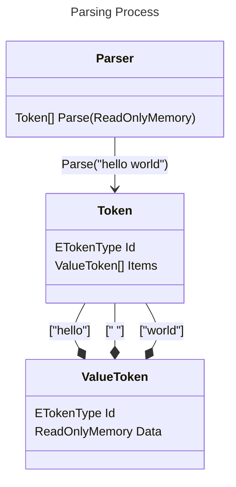

# MetaParser - _Beta_

## Overview
MetaParser is a C# source code generator which produces a text parser/tokenizer based on a definition file.   
The definition file is a simple json file with the extension '.metaparser.json' which adheres to the metaparser schema.
Schemas can be found under the "Schemas" folder at this repositories root.

## Usage
Get started by installing the nuget package `MetaParser`.   
- Create new file: `<filename>.metaparser.json`   
- Set files type to an "analyzer additional file" in your project settings 
- OR from visual studio select _"C# analyzer additional file"_ from the _"Build Action"_ dropdown list under file properties.
- Define parser using schema format below.
   
Note: _An example definition file can be found at the bottom of this readme._

### Output
Each definition file will result in the generation of a new `Parser` class under the namespace specified in the parser definition file.
The generated parser class contains a method named `Parse(ReadOnlyMemory input)` which outputs a list of `Token` objects.
Below is a diagram illustrating the generated parser class structure.



## Definition Files
A MetaParser definition file is a simple JSON object structure with only a handful of primary fields;
- $schema: _which version of the metaparser schema the file adheres to_
- namespace: _namespace which the generated parsing code will reside in_
- definitions: _collection of token pattern definitions for the parser to detect and consume_

### Tokens
The _definitions_ field is an JSON object, and each named property within it is a token whose name corrosponds to the property name.
There are 3 types of tokens.

// TODO: Finish explaining token types

## Example Parser File
```json
{
  "$schema": "https://raw.githubusercontent.com/dsisco11/MetaParser/master/Schemas/schema-01.json",
  "namespace": "ExampleParser",
  "definitions": {
    "char_open_bracket": {
      "$type": "constant",
      "value": "{"
    },
    "char_close_bracket": {
      "$type": "constant",
      "value": "}"
    },
    "char_asterisk": {
      "$type": "constant",
      "value": "*"
    },
    "char_solidus": {
      "$type": "constant",
      "value": "/"
    },
    "char_reverse_solidus": {
      "$type": "constant",
      "value": "\\"
    },
    "whitespace": {
      "$type": "compound",
      "consume": [ " ", "\t", "\f" ]
    },
    "digits": {
      "$type": "compound",
      "consume": { "range": [ "0", "9" ] }
    },
    "letters": {
      "$type": "compound",
      "consume": [
        { "range": [ "a", "z" ] },
        { "range": [ "A", "Z" ] }
      ]
    },
    "newline": {
      "$type": "compound",
      "consume": "\n"
    },
    "identifier": {
      "$type": "complex",
      "start": [ "letters" ],
      "consume": [ "letters", "digits" ]
    },
    "comment": {
      "$type": "complex",
      "start": [ "char_solidus", "char_asterisk" ],
      "stop": [ "char_asterisk", "char_solidus" ],
      "escape": [ "char_reverse_solidus" ]
    },
    "codeblock": {
      "$type": "complex",
      "start": [ "char_open_bracket" ],
      "stop": [ "char_close_bracket" ]
    }
  }
}
```
