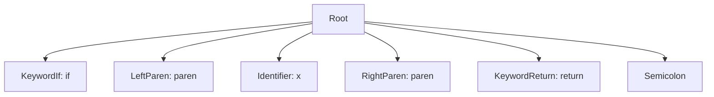

# MetaParser v2 - Green Token Type Hierarchy

> **Document Created:** December 30, 2025  
> **Status:** Draft

---

## Table of Contents

1. [Overview](#overview)
2. [Design Goals](#design-goals)
3. [Text Storage Strategy](#text-storage-strategy)
4. [Core Type Hierarchy](#core-type-hierarchy)
5. [GreenNode Base Class](#greennode-base-class)
6. [GreenToken Class](#greentoken-class)
7. [GreenTrivia Class](#greentrivia-class)
8. [Specialized Token Types](#specialized-token-types)
9. [Token Factory](#token-factory)
10. [Caching Strategy](#caching-strategy)
11. [Memory Layout](#memory-layout)

---

## Overview

This document defines the C# class hierarchy for green nodes in MetaParser v2. Green nodes are the immutable, structural "bricks" of the AST that can be cached and shared across parse trees.

### Key Characteristics

- **Immutable** - Once created, never modified
- **Position-agnostic** - Store width, not absolute position
- **Parent-unaware** - Only navigate downward to children
- **Cacheable** - Identical nodes shared across trees
- **Trivia-aware** - Support leading/trailing trivia

---

## Design Goals

1. **Memory Efficiency** - Minimize allocations through caching and compact representation
2. **Type Safety** - Strong typing for different token kinds
3. **Roslyn Compatibility** - Follow proven patterns from Roslyn's implementation
4. **Generation-Friendly** - Easy to generate specialized types per token definition
5. **Performance** - O(1) child access, efficient width calculations

---

## Text Storage Strategy

Green tokens use different storage strategies based on token category to balance memory efficiency and lifetime management:

| Token Category | Storage | Rationale |
|----------------|---------|-----------|
| **Cacheable** (keywords, operators) | `string` | Singleton instances, shared |
| **Identifiers** | `string` | Often reused, benefit from interning |
| **Trivia** (whitespace, comments) | `ReadOnlyMemory<char>` | High volume, rarely accessed |
| **String literals** | `ReadOnlyMemory<char>` | Large, unique per occurrence |
| **Number literals** | `ReadOnlyMemory<char>` | Unique values, rarely reused |

```csharp
/// <summary>
/// Token with cached string text (keywords, identifiers).
/// </summary>
public abstract class GreenStringToken : GreenToken
{
    private readonly string _text;
    public override ReadOnlySpan<char> GetText() => _text.AsSpan();
    public string TextString => _text;
}

/// <summary>
/// Token with memory-backed text (trivia, literals).
/// </summary>
public abstract class GreenMemoryToken : GreenToken
{
    private readonly ReadOnlyMemory<char> _text;
    public override ReadOnlySpan<char> GetText() => _text.Span;
    
    /// <summary>
    /// Materializes text as string (allocates).
    /// </summary>
    public string TextString => new string(_text.Span);
}
```

### Unified Interface

Both approaches expose text through a common interface:

```csharp
public abstract class GreenToken : GreenNode
{
    /// <summary>
    /// Gets the text content as a span (zero-allocation).
    /// </summary>
    public abstract ReadOnlySpan<char> GetText();
    
    /// <summary>
    /// Gets the text length.
    /// </summary>
    public abstract int TextLength { get; }
}
```

### Trivia with Memory Storage

```csharp
/// <summary>
/// Trivia backed by memory slice - no string allocation.
/// </summary>
public sealed class GreenTrivia : GreenNode
{
    private readonly ReadOnlyMemory<char> _text;
    
    public ReadOnlySpan<char> Text => _text.Span;
    public int TextLength => _text.Length;
    public override bool IsTrivia => true;
    
    internal GreenTrivia(ushort kind, ReadOnlyMemory<char> text)
        : base(kind, text.Length)
    {
        _text = text;
    }
    
    /// <summary>
    /// Creates trivia from string (for cached common patterns).
    /// </summary>
    internal GreenTrivia(ushort kind, string text)
        : base(kind, text.Length)
    {
        _text = text.AsMemory();
    }
}
```

### Lifetime Considerations

When using `ReadOnlyMemory<char>`:

1. **Parsing Phase** - Memory points to input buffer slices
2. **Tree Retention** - If green tree must outlive input:
   - Option A: Copy to string before input disposal
   - Option B: Use `MemoryPool<char>` with ownership transfer
   - Option C: Keep input buffer alive (reference counted)

```csharp
/// <summary>
/// Creates a copy of this green tree with fully owned string data.
/// Call before disposing the input buffer if the tree must be retained.
/// </summary>
/// <returns>A new tree where all Memory-backed tokens are converted to string-backed tokens.</returns>
public GreenNode ToOwned()
{
    // Recursively convert Memory<char> to owned strings
    // Returns new tree with string-backed tokens
}
```

The `ToOwned()` pattern (inspired by Rust) makes ownership transfer explicit:

```csharp
// Parse with zero-copy from input buffer
var tree = parser.Parse(inputBuffer);

// If we need to keep the tree after disposing input:
var ownedTree = tree.ToOwned();
inputBuffer.Dispose();

// ownedTree is now safe to use indefinitely
```

### Formatting Support (IFormattable)

All green nodes implement `IFormattable` to support converting the tree back to text or other representations for debugging:

```csharp
public abstract class GreenNode : IFormattable
{
    /// <summary>
    /// Formats this node using the specified format string.
    /// </summary>
    /// <param name="format">
    /// Format specifier:
    ///   - null/"" or "T" - Text (reconstructed source)
    ///   - "M" - Mermaid flowchart diagram
    ///   - "D" - Debug tree view
    ///   - "J" - JSON representation
    /// </param>
    public string ToString(string? format, IFormatProvider? formatProvider = null)
    {
        return format?.ToUpperInvariant() switch
        {
            null or "" or "T" => ToText(),
            "M" => ToMermaid(),
            "D" => ToDebugString(),
            "J" => ToJson(),
            _ => throw new FormatException($"Unknown format: {format}")
        };
    }
    
    /// <summary>
    /// Reconstructs the original source text from this node.
    /// </summary>
    public abstract string ToText();
    
    /// <summary>
    /// Creates a Mermaid flowchart representation for debugging.
    /// </summary>
    public string ToMermaid() => GreenNodeFormatter.ToMermaid(this);
    
    /// <summary>
    /// Creates a debug tree view.
    /// </summary>
    public string ToDebugString() => GreenNodeFormatter.ToDebugString(this);
}
```

**Example Mermaid Output:**

```csharp
var tree = parser.Parse("if (x) return;");
Console.WriteLine(tree.ToString("M"));
```

Outputs:


**Formatter Implementation:**

```csharp
internal static class GreenNodeFormatter
{
    public static string ToMermaid(GreenNode root)
    {
        var sb = new StringBuilder();
        sb.AppendLine("flowchart TB");
        
        var nodeId = 0;
        void Visit(GreenNode node, int parentId, ref int id)
        {
            var currentId = id++;
            var label = node.IsToken 
                ? $"{node.RawKind}: {((GreenToken)node).GetText()}"
                : node.RawKind.ToString();
            
            sb.AppendLine($"    N{currentId}[\"{EscapeMermaid(label)}\"]");
            
            if (parentId >= 0)
                sb.AppendLine($"    N{parentId} --> N{currentId}");
            
            for (int i = 0; i < node.SlotCount; i++)
            {
                var child = node.GetSlot(i);
                if (child != null)
                    Visit(child, currentId, ref id);
            }
        }
        
        Visit(root, -1, ref nodeId);
        return sb.ToString();
    }
    
    public static string ToDebugString(GreenNode root)
    {
        var sb = new StringBuilder();
        
        void Visit(GreenNode node, int depth)
        {
            sb.Append(' ', depth * 2);
            sb.Append(node.RawKind);
            
            if (node.IsToken)
                sb.Append($" \"{((GreenToken)node).GetText()}\"");
            
            sb.AppendLine($" [{node.FullWidth}]");
            
            for (int i = 0; i < node.SlotCount; i++)
            {
                var child = node.GetSlot(i);
                if (child != null)
                    Visit(child, depth + 1);
            }
        }
        
        Visit(root, 0);
        return sb.ToString();
    }
    
    private static string EscapeMermaid(string text)
    {
        return text
            .Replace("\"", "#quot;")
            .Replace("<", "#lt;")
            .Replace(">", "#gt;");
    }
}
```

---

## Core Type Hierarchy

```
GreenNode (abstract)
├── GreenToken (abstract)
│   ├── GreenTokenWithNoTrivia
│   ├── GreenTokenWithLeadingTrivia
│   ├── GreenTokenWithTrailingTrivia
│   └── GreenTokenWithTrivia
├── GreenTrivia
└── GreenList
    ├── GreenList.WithTwoChildren
    ├── GreenList.WithThreeChildren
    ├── GreenList.WithManyChildren
    └── GreenList.WithLotsOfChildren
```

### Generated Types (Per Schema)

For each token defined in the schema, specialized types are generated:

```
GreenToken
├── Generated.GreenKeywordIfToken
├── Generated.GreenKeywordElseToken
├── Generated.GreenIdentifierToken
├── Generated.GreenNumberToken
├── Generated.GreenStringLiteralToken
└── ...
```

---

## GreenNode Base Class

The abstract base for all green nodes.

```csharp
namespace MetaParser.Syntax.Green;

/// <summary>
/// Base class for all immutable green nodes in the syntax tree.
/// Green nodes are structural, position-agnostic, and cacheable.
/// </summary>
public abstract class GreenNode
{
    #region Packed Data
    // Bit layout (64 bits total):
    // [0-15]   RawKind (ushort) - Token/node kind
    // [16-19]  SlotCount (4 bits) - Number of children (15 = use virtual)
    // [20-31]  Flags (12 bits) - Boolean flags
    // [32-63]  FullWidth (32 bits) - Total width including trivia

    private readonly ushort _kind;
    private readonly ushort _flagsAndSlotCount;
    private readonly int _fullWidth;
    #endregion

    #region Properties
    /// <summary>
    /// The kind of this node, used for fast type checking.
    /// </summary>
    public ushort RawKind => _kind;

    /// <summary>
    /// Total width in characters including all trivia.
    /// </summary>
    public int FullWidth => _fullWidth;

    /// <summary>
    /// Width in characters excluding trivia.
    /// </summary>
    public virtual int Width => _fullWidth;

    /// <summary>
    /// Number of child slots in this node.
    /// </summary>
    public int SlotCount
    {
        get
        {
            var count = _flagsAndSlotCount & 0x0F;
            return count == 15 ? GetSlotCount() : count;
        }
    }
    #endregion

    #region Flags
    [Flags]
    protected enum NodeFlags : ushort
    {
        None = 0,
        ContainsDiagnostics = 1 << 0,
        ContainsAnnotations = 1 << 1,
        ContainsDirectives = 1 << 2,
        ContainsSkippedText = 1 << 3,
        IsMissing = 1 << 4,
        // Reserved: bits 5-11
    }

    protected NodeFlags Flags => (NodeFlags)((_flagsAndSlotCount >> 4) & 0x0FFF);

    public bool ContainsDiagnostics => (Flags & NodeFlags.ContainsDiagnostics) != 0;
    public bool IsMissing => (Flags & NodeFlags.IsMissing) != 0;
    #endregion

    #region Constructors
    protected GreenNode(ushort kind, int fullWidth)
    {
        _kind = kind;
        _fullWidth = fullWidth;
        _flagsAndSlotCount = 0;
    }

    protected GreenNode(ushort kind, int fullWidth, int slotCount, NodeFlags flags = NodeFlags.None)
    {
        _kind = kind;
        _fullWidth = fullWidth;
        _flagsAndSlotCount = (ushort)((slotCount & 0x0F) | ((ushort)flags << 4));
    }
    #endregion

    #region Child Access
    /// <summary>
    /// Gets the child node at the specified slot index.
    /// </summary>
    public abstract GreenNode? GetSlot(int index);

    /// <summary>
    /// Override for nodes with more than 15 slots.
    /// </summary>
    protected virtual int GetSlotCount() => 0;

    /// <summary>
    /// Gets the character offset of a child slot relative to this node's start.
    /// </summary>
    public virtual int GetSlotOffset(int index)
    {
        var offset = 0;
        for (var i = 0; i < index; i++)
        {
            var child = GetSlot(i);
            if (child != null)
            {
                offset += child.FullWidth;
            }
        }
        return offset;
    }
    #endregion

    #region Virtual Type Checks
    public virtual bool IsToken => false;
    public virtual bool IsTrivia => false;
    public virtual bool IsList => false;
    #endregion

    #region Red Node Creation
    /// <summary>
    /// Creates the corresponding red node wrapper.
    /// </summary>
    internal abstract RedNode CreateRed(RedNode? parent, int position);
    #endregion
}
```

---

## GreenToken Class

The base class for all terminal tokens (leaf nodes).

```csharp
namespace MetaParser.Syntax.Green;

/// <summary>
/// Base class for terminal tokens - leaf nodes containing actual text.
/// </summary>
public abstract class GreenToken : GreenNode
{
    #region Fields
    private readonly string _text;
    #endregion

    #region Properties
    /// <summary>
    /// The text content of this token (excluding trivia).
    /// </summary>
    public string Text => _text;

    public override int Width => _text.Length;
    public override bool IsToken => true;

    /// <summary>
    /// Width of leading trivia.
    /// </summary>
    public virtual int LeadingTriviaWidth => 0;

    /// <summary>
    /// Width of trailing trivia.
    /// </summary>
    public virtual int TrailingTriviaWidth => 0;

    /// <summary>
    /// Leading trivia attached to this token.
    /// </summary>
    public virtual GreenNode? LeadingTrivia => null;

    /// <summary>
    /// Trailing trivia attached to this token.
    /// </summary>
    public virtual GreenNode? TrailingTrivia => null;
    #endregion

    #region Constructors
    protected GreenToken(ushort kind, string text)
        : base(kind, text.Length)
    {
        _text = text;
    }

    protected GreenToken(ushort kind, string text, int fullWidth)
        : base(kind, fullWidth)
    {
        _text = text;
    }
    #endregion

    #region Child Access
    public override GreenNode? GetSlot(int index) => null;
    #endregion

    #region Trivia Manipulation
    /// <summary>
    /// Creates a new token with the specified leading trivia.
    /// </summary>
    public abstract GreenToken WithLeadingTrivia(GreenNode? trivia);

    /// <summary>
    /// Creates a new token with the specified trailing trivia.
    /// </summary>
    public abstract GreenToken WithTrailingTrivia(GreenNode? trivia);
    #endregion
}
```

### Token Variants by Trivia

To minimize memory usage, different classes handle different trivia configurations:

```csharp
/// <summary>
/// Token with no trivia (most common, most compact).
/// </summary>
internal sealed class GreenTokenWithNoTrivia : GreenToken
{
    internal GreenTokenWithNoTrivia(ushort kind, string text)
        : base(kind, text) { }

    public override GreenToken WithLeadingTrivia(GreenNode? trivia)
    {
        if (trivia == null) return this;
        return new GreenTokenWithLeadingTrivia(RawKind, Text, trivia);
    }

    public override GreenToken WithTrailingTrivia(GreenNode? trivia)
    {
        if (trivia == null) return this;
        return new GreenTokenWithTrailingTrivia(RawKind, Text, trivia);
    }

    internal override RedNode CreateRed(RedNode? parent, int position)
        => new RedToken(this, parent, position);
}

/// <summary>
/// Token with only leading trivia.
/// </summary>
internal sealed class GreenTokenWithLeadingTrivia : GreenToken
{
    private readonly GreenNode _leadingTrivia;

    internal GreenTokenWithLeadingTrivia(ushort kind, string text, GreenNode leadingTrivia)
        : base(kind, text, leadingTrivia.FullWidth + text.Length)
    {
        _leadingTrivia = leadingTrivia;
    }

    public override int LeadingTriviaWidth => _leadingTrivia.FullWidth;
    public override GreenNode? LeadingTrivia => _leadingTrivia;

    public override GreenToken WithLeadingTrivia(GreenNode? trivia)
    {
        if (trivia == null) return new GreenTokenWithNoTrivia(RawKind, Text);
        return new GreenTokenWithLeadingTrivia(RawKind, Text, trivia);
    }

    public override GreenToken WithTrailingTrivia(GreenNode? trivia)
    {
        if (trivia == null) return this;
        return new GreenTokenWithTrivia(RawKind, Text, _leadingTrivia, trivia);
    }

    internal override RedNode CreateRed(RedNode? parent, int position)
        => new RedToken(this, parent, position);
}

/// <summary>
/// Token with only trailing trivia.
/// </summary>
internal sealed class GreenTokenWithTrailingTrivia : GreenToken
{
    private readonly GreenNode _trailingTrivia;

    internal GreenTokenWithTrailingTrivia(ushort kind, string text, GreenNode trailingTrivia)
        : base(kind, text, text.Length + trailingTrivia.FullWidth)
    {
        _trailingTrivia = trailingTrivia;
    }

    public override int TrailingTriviaWidth => _trailingTrivia.FullWidth;
    public override GreenNode? TrailingTrivia => _trailingTrivia;

    public override GreenToken WithLeadingTrivia(GreenNode? trivia)
    {
        if (trivia == null) return this;
        return new GreenTokenWithTrivia(RawKind, Text, trivia, _trailingTrivia);
    }

    public override GreenToken WithTrailingTrivia(GreenNode? trivia)
    {
        if (trivia == null) return new GreenTokenWithNoTrivia(RawKind, Text);
        return new GreenTokenWithTrailingTrivia(RawKind, Text, trivia);
    }

    internal override RedNode CreateRed(RedNode? parent, int position)
        => new RedToken(this, parent, position);
}

/// <summary>
/// Token with both leading and trailing trivia.
/// </summary>
internal sealed class GreenTokenWithTrivia : GreenToken
{
    private readonly GreenNode _leadingTrivia;
    private readonly GreenNode _trailingTrivia;

    internal GreenTokenWithTrivia(
        ushort kind,
        string text,
        GreenNode leadingTrivia,
        GreenNode trailingTrivia)
        : base(kind, text, leadingTrivia.FullWidth + text.Length + trailingTrivia.FullWidth)
    {
        _leadingTrivia = leadingTrivia;
        _trailingTrivia = trailingTrivia;
    }

    public override int LeadingTriviaWidth => _leadingTrivia.FullWidth;
    public override int TrailingTriviaWidth => _trailingTrivia.FullWidth;
    public override GreenNode? LeadingTrivia => _leadingTrivia;
    public override GreenNode? TrailingTrivia => _trailingTrivia;

    public override GreenToken WithLeadingTrivia(GreenNode? trivia)
    {
        if (trivia == null) return new GreenTokenWithTrailingTrivia(RawKind, Text, _trailingTrivia);
        return new GreenTokenWithTrivia(RawKind, Text, trivia, _trailingTrivia);
    }

    public override GreenToken WithTrailingTrivia(GreenNode? trivia)
    {
        if (trivia == null) return new GreenTokenWithLeadingTrivia(RawKind, Text, _leadingTrivia);
        return new GreenTokenWithTrivia(RawKind, Text, _leadingTrivia, trivia);
    }

    internal override RedNode CreateRed(RedNode? parent, int position)
        => new RedToken(this, parent, position);
}
```

---

## GreenTrivia Class

Represents trivia (whitespace, comments, etc.).

```csharp
namespace MetaParser.Syntax.Green;

/// <summary>
/// Represents trivia - non-semantic content like whitespace and comments.
/// </summary>
public sealed class GreenTrivia : GreenNode
{
    private readonly string _text;

    public string Text => _text;
    public override bool IsTrivia => true;

    internal GreenTrivia(ushort kind, string text)
        : base(kind, text.Length)
    {
        _text = text;
    }

    public override GreenNode? GetSlot(int index) => null;

    internal override RedNode CreateRed(RedNode? parent, int position)
        => throw new InvalidOperationException("Trivia cannot create red nodes directly.");
}
```

---

## Specialized Token Types

### Generated Token Classes

For each token in the schema, a specialized class is generated:

```csharp
// Generated for: "keyword_if": { "consume": "if" }
namespace MyParser.Syntax.Green;

internal sealed class GreenKeywordIfToken : GreenToken
{
    public static readonly GreenKeywordIfToken Instance = new();

    private GreenKeywordIfToken() : base(TokenKind.KeywordIf, "if") { }

    public override GreenToken WithLeadingTrivia(GreenNode? trivia)
    {
        if (trivia == null) return this;
        return new GreenKeywordIfTokenWithLeadingTrivia(trivia);
    }

    public override GreenToken WithTrailingTrivia(GreenNode? trivia)
    {
        if (trivia == null) return this;
        return new GreenKeywordIfTokenWithTrailingTrivia(trivia);
    }

    internal override RedNode CreateRed(RedNode? parent, int position)
        => new RedKeywordIfToken(this, parent, position);
}
```

### Variable-Text Tokens

For tokens with variable content (identifiers, numbers, strings):

```csharp
// Generated for: "identifier": { ... }
namespace MyParser.Syntax.Green;

internal sealed class GreenIdentifierToken : GreenToken
{
    internal GreenIdentifierToken(string text)
        : base(TokenKind.Identifier, text) { }

    public override GreenToken WithLeadingTrivia(GreenNode? trivia)
    {
        if (trivia == null) return this;
        return new GreenIdentifierTokenWithLeadingTrivia(Text, trivia);
    }

    public override GreenToken WithTrailingTrivia(GreenNode? trivia)
    {
        if (trivia == null) return this;
        return new GreenIdentifierTokenWithTrailingTrivia(Text, trivia);
    }

    internal override RedNode CreateRed(RedNode? parent, int position)
        => new RedIdentifierToken(this, parent, position);
}
```

### Composite Tokens

For tokens that contain child tokens:

```csharp
// Generated for higher-level tokens that consume other tokens
namespace MyParser.Syntax.Green;

internal sealed class GreenNumberToken : GreenToken
{
    private readonly GreenNode _digits;  // List of digit tokens

    internal GreenNumberToken(GreenNode digits)
        : base(TokenKind.Number, ComputeText(digits), digits.FullWidth)
    {
        _digits = digits;
    }

    public GreenNode Digits => _digits;

    public override GreenNode? GetSlot(int index) => index == 0 ? _digits : null;

    private static string ComputeText(GreenNode digits)
    {
        // Concatenate text from all child digit tokens
        var sb = new StringBuilder();
        for (int i = 0; i < digits.SlotCount; i++)
        {
            if (digits.GetSlot(i) is GreenToken token)
                sb.Append(token.Text);
        }
        return sb.ToString();
    }

    // ... trivia methods, CreateRed, etc.
}
```

---

## Token Factory

The factory handles token creation with caching.

```csharp
namespace MetaParser.Syntax.Green;

/// <summary>
/// Factory for creating green tokens with caching support.
/// </summary>
public static class GreenTokenFactory
{
    #region Cached Tokens
    // Pre-cached tokens for well-known text (keywords, operators)
    private static readonly Dictionary<ushort, GreenToken> s_cachedTokensNoTrivia = new();

    // Cache for tokens with single trailing space (very common)
    private static readonly Dictionary<ushort, GreenToken> s_cachedTokensWithSpace = new();

    // Cache for variable-text tokens (LRU or weak references)
    private static readonly ConditionalWeakTable<string, GreenToken> s_identifierCache = new();
    #endregion

    #region Static Initialization
    static GreenTokenFactory()
    {
        // Pre-cache all fixed-text tokens
        CacheToken(GreenKeywordIfToken.Instance);
        CacheToken(GreenKeywordElseToken.Instance);
        // ... etc for all keywords and operators
    }

    private static void CacheToken(GreenToken token)
    {
        s_cachedTokensNoTrivia[token.RawKind] = token;
    }
    #endregion

    #region Token Creation
    /// <summary>
    /// Gets or creates a token of the specified kind with no trivia.
    /// </summary>
    public static GreenToken Token(ushort kind)
    {
        if (s_cachedTokensNoTrivia.TryGetValue(kind, out var cached))
            return cached;

        throw new ArgumentException($"No cached token for kind {kind}");
    }

    /// <summary>
    /// Gets or creates a token with the specified kind and text.
    /// </summary>
    public static GreenToken Token(ushort kind, string text)
    {
        // Check if this is a fixed-text token
        if (s_cachedTokensNoTrivia.TryGetValue(kind, out var cached))
        {
            if (cached.Text == text)
                return cached;
        }

        // Create new token (may be cached for identifiers/numbers)
        return CreateVariableToken(kind, text);
    }

    /// <summary>
    /// Gets or creates an identifier token.
    /// </summary>
    public static GreenToken Identifier(string text)
    {
        if (s_identifierCache.TryGetValue(text, out var cached))
            return cached;

        var token = new GreenIdentifierToken(text);
        s_identifierCache.AddOrUpdate(text, token);
        return token;
    }
    #endregion

    #region Trivia Creation
    /// <summary>
    /// Creates whitespace trivia.
    /// </summary>
    public static GreenTrivia Whitespace(string text)
    {
        // Could cache common whitespace patterns
        return new GreenTrivia(TriviaKind.Whitespace, text);
    }

    /// <summary>
    /// Creates a single space trivia (cached).
    /// </summary>
    public static GreenTrivia Space { get; } = new(TriviaKind.Whitespace, " ");

    /// <summary>
    /// Creates newline trivia.
    /// </summary>
    public static GreenTrivia Newline { get; } = new(TriviaKind.Newline, "\n");

    /// <summary>
    /// Creates CRLF trivia.
    /// </summary>
    public static GreenTrivia CrLf { get; } = new(TriviaKind.Newline, "\r\n");
    #endregion

    #region List Creation
    /// <summary>
    /// Creates a list of nodes.
    /// </summary>
    public static GreenNode List(params GreenNode[] nodes)
    {
        return nodes.Length switch
        {
            0 => GreenList.Empty,
            1 => nodes[0],
            2 => new GreenList.WithTwoChildren(nodes[0], nodes[1]),
            3 => new GreenList.WithThreeChildren(nodes[0], nodes[1], nodes[2]),
            < 10 => new GreenList.WithManyChildren(nodes),
            _ => new GreenList.WithLotsOfChildren(nodes)
        };
    }
    #endregion
}
```

---

## Caching Strategy

### What Gets Cached

| Token Type                            | Caching Strategy          |
| ------------------------------------- | ------------------------- |
| Keywords (`if`, `else`, etc.)         | Singleton instances       |
| Operators (`+`, `-`, etc.)            | Singleton instances       |
| Fixed punctuation (`;`, `{`, etc.)    | Singleton instances       |
| Common trivia (single space, newline) | Singleton instances       |
| Identifiers                           | Weak reference cache      |
| Numbers                               | No caching (too variable) |
| String literals                       | No caching                |

### Cache Variants

Following Roslyn, each fixed-text token has pre-cached variants:

```csharp
// For keyword "if":
static class CachedKeywordIf
{
    // No trivia
    public static readonly GreenToken NoTrivia = new GreenKeywordIfToken();

    // Single trailing space (most common)
    public static readonly GreenToken TrailingSpace =
        NoTrivia.WithTrailingTrivia(GreenTokenFactory.Space);

    // Trailing newline
    public static readonly GreenToken TrailingNewline =
        NoTrivia.WithTrailingTrivia(GreenTokenFactory.Newline);
}
```

---

## Memory Layout

### GreenNode (Base) - 12 bytes

```
┌──────────────────────────────────────┐
│ _kind (ushort)              2 bytes  │
│ _flagsAndSlotCount (ushort) 2 bytes  │
│ _fullWidth (int)            4 bytes  │
│ [object header]             8 bytes  │ (CLR overhead)
└──────────────────────────────────────┘
```

### GreenToken (No Trivia) - 20+ bytes

```
┌──────────────────────────────────────┐
│ GreenNode fields           12 bytes  │
│ _text (string ref)          8 bytes  │
│ [object header]             8 bytes  │
└──────────────────────────────────────┘
```

### GreenTokenWithTrivia - 36+ bytes

```
┌──────────────────────────────────────┐
│ GreenNode fields           12 bytes  │
│ _text (string ref)          8 bytes  │
│ _leadingTrivia (ref)        8 bytes  │
│ _trailingTrivia (ref)       8 bytes  │
│ [object header]             8 bytes  │
└──────────────────────────────────────┘
```

### Memory Savings Through Caching

For a typical source file:

- ~95% of keywords reference cached singletons
- ~80% of punctuation references cached singletons
- Only identifiers, numbers, and strings allocate new objects

---

## Appendix: TokenKind Enum

Generated for each schema:

```csharp
namespace MyParser.Syntax;

/// <summary>
/// Identifies the kind of a syntax token.
/// </summary>
public enum TokenKind : ushort
{
    None = 0,

    // Trivia (1-99)
    WhitespaceTrivia = 1,
    NewlineTrivia = 2,
    LineCommentTrivia = 3,
    BlockCommentTrivia = 4,

    // Tokens (100+)
    EndOfFile = 100,

    // Keywords
    KeywordIf = 101,
    KeywordElse = 102,
    KeywordWhile = 103,
    KeywordReturn = 104,

    // Identifiers and Literals
    Identifier = 200,
    NumberLiteral = 201,
    StringLiteral = 202,

    // Operators
    Plus = 300,
    Minus = 301,
    Asterisk = 302,
    Slash = 303,

    // Punctuation
    Semicolon = 400,
    LeftBrace = 401,
    RightBrace = 402,
    LeftParen = 403,
    RightParen = 404,
}
```

---

_This document defines the green token type hierarchy for MetaParser v2. The design follows Roslyn's proven patterns while remaining generation-friendly._
