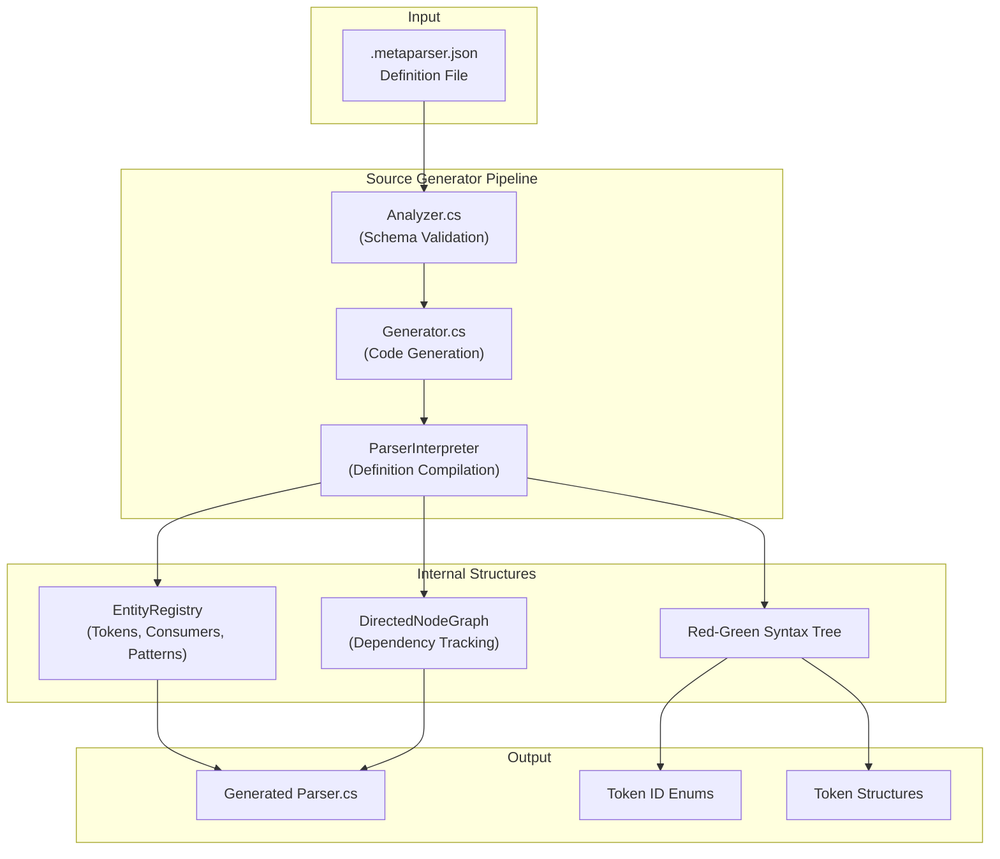

# MetaParser - Project Overview

> **Last Updated:** December 30, 2025  
> **Version:** 1.0.7 (Beta)  
> **Target Framework:** .NET Standard 2.0 (Roslyn Source Generator)

---

## Table of Contents

1. [Project Summary](#project-summary)
2. [Architecture Overview](#architecture-overview)
3. [Project Structure](#project-structure)
4. [Key Components](#key-components)
5. [Technology Stack](#technology-stack)
6. [Development Status](#development-status)
7. [Testing Infrastructure](#testing-infrastructure)
8. [Future Roadmap](#future-roadmap)

---

## Project Summary

**MetaParser** is a C# Roslyn Source Generator that automatically generates text parsers and tokenizers based on JSON definition files. Users define their parsing rules in a `.metaparser.json` file, and the generator produces a complete `Parser` class capable of tokenizing input text.

### Core Functionality

- **Input:** JSON definition files (`.metaparser.json`) describing token patterns and parsing stages
- **Output:** Generated C# parser classes with `Parse(ReadOnlyMemory<char> input)` method
- **Result:** Array of `Token` objects containing parsed segments

### Use Cases

- Building custom text parsers without manual tokenization code
- Creating domain-specific languages (DSLs)
- Parsing structured text formats
- Lexical analysis and syntax highlighting tools

---

## Architecture Overview



### Processing Stages

1. **Schema Validation** - JSON definition validated against MetaParser schema
2. **Deserialization** - JSON parsed into `ParserDefinition` objects
3. **Interpretation** - Definition compiled through multiple stages (Declared → Assigned → Specified → Computed → Used → Ready)
4. **Code Generation** - Final C# source code emitted via Roslyn

---

## Project Structure

```
MetaParser/
├── MetaParser.sln                    # Solution file
├── README.md                         # User documentation
├── thoughts.md                       # Design notes
│
├── MetaParser/                       # Main source generator project
│   ├── Analyzer.cs                   # Roslyn incremental generator (validation)
│   ├── Generator.cs                  # Roslyn incremental generator (code gen)
│   ├── Common.cs                     # Shared utilities
│   ├── DIAGNOSTIC_DEFS.cs            # Diagnostic definitions
│   │
│   ├── Builders/                     # Code generation builders
│   │   ├── Core/                     # Core builder utilities
│   │   ├── Interfaces/               # Builder interfaces
│   │   ├── Parser/                   # Parser class builders
│   │   ├── TokenLogic/               # Token processing builders
│   │   ├── RedGreenTreeBuilder.cs
│   │   ├── TokenIDConstBuilder.cs
│   │   ├── TokenIDEnumBuilder.cs
│   │   └── TokenStructBuilder.cs
│   │
│   ├── Compiler/                     # Definition interpretation
│   │   ├── ParserInterpreter.cs      # Main compilation logic
│   │   ├── EInterpreterStage.cs      # Interpreter state machine
│   │   └── Structs/
│   │
│   ├── Core/                         # Core infrastructure
│   │   ├── CodeGenContext.cs         # Code generation context
│   │   ├── CodeGenState.cs           # Generation state tracking
│   │   ├── EntityRegistry.cs         # Token/Consumer/Pattern registry
│   │   ├── ParserConfiguration.cs    # Parser config model
│   │   ├── ParserContext.cs          # Runtime parser context
│   │   └── WorkingSet.cs
│   │
│   ├── Exceptions/                   # Custom exceptions
│   │   ├── IllegalTokenException.cs
│   │   ├── MalformedSchemaException.cs
│   │   ├── MetaParserException.cs
│   │   ├── PatternNotFoundException.cs
│   │   └── UnknownTokenException.cs
│   │
│   ├── Graphs/                       # Graph data structures
│   │   ├── DirectedNodeGraph.cs      # Dependency graph implementation
│   │   ├── EntityKey.cs              # Entity identification
│   │   ├── GraphEntity.cs            # Base entity type
│   │   ├── KeyTreeNodeWalker.cs      # Tree traversal
│   │   └── Node*.cs                  # Graph node types
│   │
│   ├── Json/                         # JSON serialization
│   │   ├── Converters/               # Custom JSON converters
│   │   └── Definitions/              # Schema definition models
│   │       ├── ParserDefinition.cs
│   │       ├── ConsumerDeclaration.cs
│   │       ├── PatternDeclaration.cs
│   │       └── *StageDefinition.cs
│   │
│   ├── Mermaid/                      # Diagram generation
│   │   ├── MermaidFormatter.cs
│   │   └── RegistryEntityFormatter.cs
│   │
│   ├── Parsing/                      # Parsing constructs
│   │   └── Constructs/
│   │       ├── Consumers/
│   │       ├── Patterns/
│   │       ├── Stages/
│   │       └── Tokens/
│   │
│   ├── Syntax/                       # Red-Green syntax tree
│   │   ├── GreenNode.cs              # Immutable node (structural)
│   │   ├── RedNode.cs                # Mutable facade (positional)
│   │   ├── SyntaxTree.cs             # Tree container
│   │   ├── SyntaxTreeBuilder.cs      # Tree construction
│   │   ├── SyntaxTreeWalker.cs       # Tree traversal
│   │   └── Nodes/                    # Specific node types
│   │
│   └── Resources/
│       └── schema.json               # Embedded schema file
│
├── Schemas/                          # JSON Schema definitions
│   ├── schema-01.json                # Legacy schema
│   └── schema-02.json                # Current schema version
│
├── SnapshotTests/                    # Verification tests
│   ├── Tests/
│   │   ├── Inputs/                   # Test input files
│   │   └── *.cs                      # Test implementations
│   └── Snapshots/                    # Expected output snapshots
│
└── UnitTests/                        # Unit test project
    ├── MetaParser/
    │   └── tokens.metaparser.json    # Test definition file
    └── TokenTests/
```

---

## Key Components

### 1. Source Generator (`Analyzer.cs`, `Generator.cs`)

Implements `IIncrementalGenerator` to integrate with the Roslyn compiler pipeline:

- **Analyzer:** Validates JSON schema compliance and reports diagnostics
- **Generator:** Orchestrates the full code generation pipeline

```csharp
[Generator(LanguageNames.CSharp)]
public partial class Generator : IIncrementalGenerator
{
    public void Initialize(IncrementalGeneratorInitializationContext context)
    {
        // Pipeline: File Discovery → JSON Parsing → Schema Compilation → Code Generation
    }
}
```

### 2. Parser Interpreter (`ParserInterpreter.cs`)

Multi-stage compiler that transforms `ParserDefinition` into executable parser logic:

| Stage         | Description                       |
| ------------- | --------------------------------- |
| **Declared**  | Initial token declarations loaded |
| **Assigned**  | Token relationships established   |
| **Specified** | Patterns and consumers resolved   |
| **Computed**  | Dependency graph computed         |
| **Used**      | Optimization pass                 |
| **Ready**     | Final generation state            |

### 3. Entity Registry (`EntityRegistry.cs`)

Centralized storage for all parsing constructs:

- **Tokens:** Named tokenization targets
- **Consumers:** Rules for consuming input characters/tokens
- **Patterns:** Matching patterns (constant, compound, etc.)

Maintains dependency graphs for:

- Token relationships
- Consumer relationships
- Pattern relationships

### 4. Red-Green Syntax Tree

Implements Roslyn's Red-Green tree pattern for efficient AST manipulation:

- **GreenNode:** Immutable, structural representation (shared across edits)
- **RedNode:** Mutable facade providing position and parent information
- **SyntaxTree:** Container with builder support

### 5. Code Builders (`Builders/`)

Modular code generation system:

- `TokenIDEnumBuilder` - Generates token type enumerations
- `TokenIDConstBuilder` - Generates token ID constants
- `TokenStructBuilder` - Generates token structure types
- `RedGreenTreeBuilder` - Generates AST node types
- Parser-specific builders in `Parser/` subdirectory

---

## Technology Stack

| Category              | Technology              | Version |
| --------------------- | ----------------------- | ------- |
| **Framework**         | .NET Standard           | 2.0     |
| **Language**          | C#                      | Latest  |
| **Code Analysis**     | Roslyn                  | 4.4+    |
| **JSON Parsing**      | System.Text.Json        | 7.0.2   |
| **Schema Validation** | JsonSchema.Net          | 3.3.2   |
| **Testing**           | xUnit                   | 2.4.x   |
| **Snapshot Testing**  | Verify.SourceGenerators | 2.1.0   |

### Dependencies

```xml
<PackageReference Include="Microsoft.CodeAnalysis.CSharp" Version="4.4.0" />
<PackageReference Include="JsonSchema.Net" Version="3.3.2" />
<PackageReference Include="System.Text.Json" Version="7.0.2" />
<PackageReference Include="H.Generators.Extensions" Version="1.9.2" />
```

---

## Development Status

### Current State: **Beta**

The project is functional but has several planned improvements noted in the codebase.

### Implemented Features ✅

- [x] JSON schema definition format
- [x] Basic token types (constant, compound)
- [x] Multi-stage parsing (lexer → parser)
- [x] Roslyn incremental generator integration
- [x] Red-Green syntax tree infrastructure
- [x] Entity registry with dependency tracking
- [x] Mermaid diagram generation for debugging
- [x] Snapshot testing infrastructure

### Known Limitations / In Progress ⚠️

Based on `TODO.md` and code comments:

- [ ] Tokens should not have consumers from multiple stages
- [ ] Consumer 'Stop' items must be mutually exclusive with 'Consume' items
- [ ] Token processor function needs to return Token instance
- [ ] Data initialization system needs refactoring
- [ ] Patterns shouldn't auto-register in constructor
- [ ] Pattern flattening should be a separate step

### Planned Features 🚀

From design documents:

1. **Async Parser Mode**

   - Asynchronous 'live' parsing for streams/large files
   - `LazySequence` class for on-demand evaluation
   - ArrayPool-based result caching

2. **Custom Token Structures**
   - Data capture for complex tokens
   - Named field support via 'field' property
   - Support for matching constructs (e.g., HTML tags)

---

## Testing Infrastructure

### Test Projects

| Project         | Purpose                       | Framework               |
| --------------- | ----------------------------- | ----------------------- |
| `UnitTests`     | Component-level tests         | xUnit                   |
| `SnapshotTests` | Generator output verification | Verify.SourceGenerators |

### Running Tests

```bash
# Run all tests
dotnet test

# Run specific project
dotnet test UnitTests/UnitTests.csproj
dotnet test SnapshotTests/SnapshotTests.csproj
```

### Test Input Files

- `UnitTests/MetaParser/tokens.metaparser.json` - Basic token definitions
- `SnapshotTests/Tests/Inputs/` - Various test scenarios including error cases

---

## Future Roadmap

Based on project documentation and code analysis:

### Short Term

- Complete TODO items from `TODO.md`
- Stabilize multi-stage parsing
- Improve error diagnostics

### Medium Term

- Implement async parser mode
- Add custom token structure support
- Expand schema validation

### Long Term

- Grammar/syntax stage support
- IDE tooling (completion, highlighting)
- Performance optimizations

---

## Getting Started (Development)

### Prerequisites

- .NET 7.0+ SDK
- Visual Studio 2022 or VS Code with C# extension

### Building

```bash
cd MetaParser
dotnet build
```

### Creating a Test Parser

1. Create a `.metaparser.json` file
2. Set build action to "C# analyzer additional file"
3. Build project to generate parser code

### Example Definition

```json
{
  "$schema": "https://raw.githubusercontent.com/dsisco11/MetaParser/master/Schemas/schema-02.json",
  "namespace": "MyParser",
  "stages": {
    "lexer": {
      "consumers": {
        "whitespace": {
          "consume": [" ", "\t", "\n"]
        },
        "digits": {
          "consume": { "range": ["0", "9"] }
        }
      }
    }
  }
}
```

---

## Contributing

This project follows standard C# conventions with Roslyn analyzer rules enforced. See `.editorconfig` for code style guidelines.

---

_This document provides a snapshot of the MetaParser project status as of the last update date. Refer to source code and commit history for the most current state._
