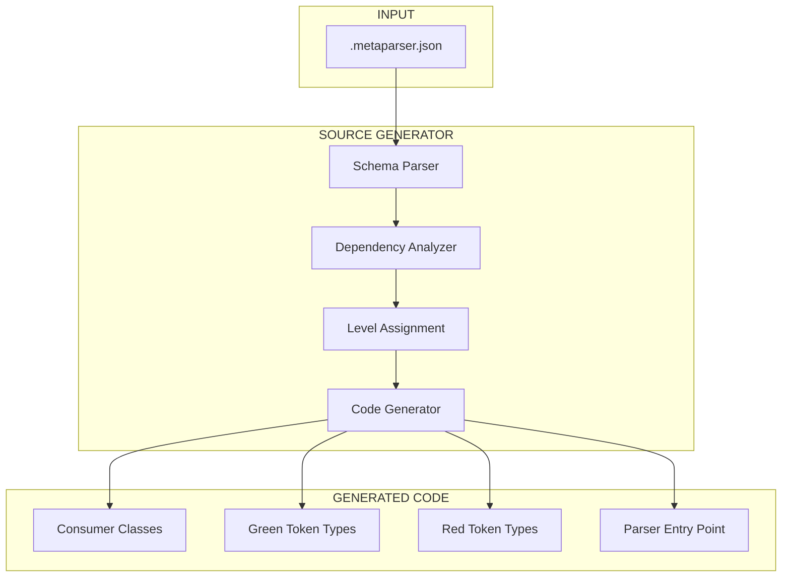
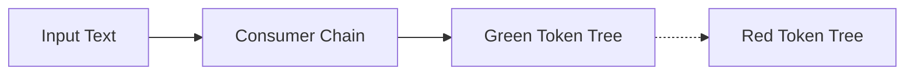
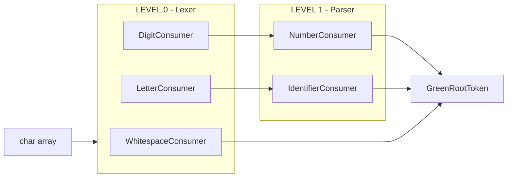
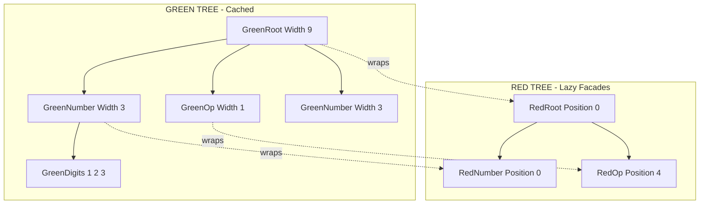
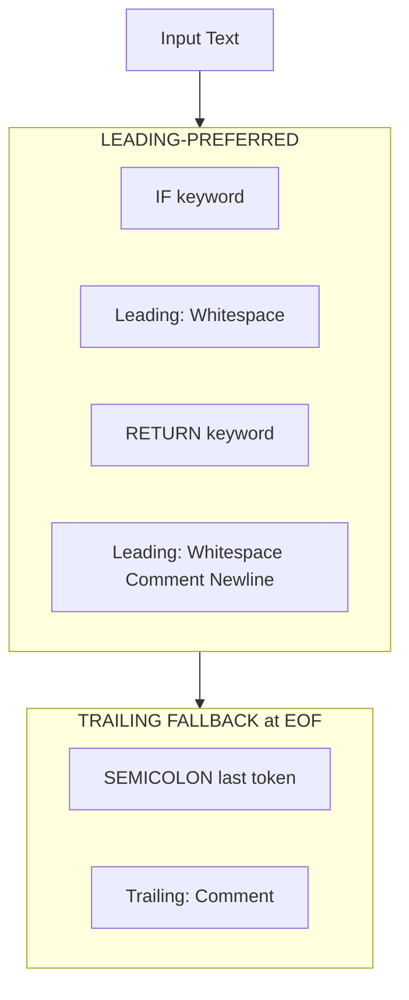

# MetaParser v2.0 - Redesign Goals

> **Document Created:** December 30, 2025  
> **Status:** Planning Phase  
> **Target Framework:** .NET 8.0

---

## Table of Contents

1. [Executive Summary](#executive-summary)
2. [Target Framework Changes](#target-framework-changes)
3. [Red-Green AST System](#red-green-ast-system)
4. [Simplified JSON Schema](#simplified-json-schema)
5. [Consumer Chain Architecture](#consumer-chain-architecture)
6. [Testing Strategy](#testing-strategy)
7. [Architecture Diagrams](#architecture-diagrams)
8. [Comparison: v1 vs v2](#comparison-v1-vs-v2)

---

## Executive Summary

MetaParser v2.0 represents a complete redesign focused on:

- **Modern .NET 8 targeting** for generated code
- **Proper Red-Green tree implementation** following Roslyn's proven patterns
- **Vastly simplified JSON schema** with automatic stage detection
- **Multi-level consumer chain** for building green token trees
- **Modern testing infrastructure** using Microsoft's source generator testing framework

---

## Target Framework Changes

### Generated Code Target

| Aspect           | v1 (Current)      | v2 (Redesign) |
| ---------------- | ----------------- | ------------- |
| Target Framework | .NET Standard 2.0 | .NET 8.0      |
| Language Version | C# Latest         | C# 12+        |
| Nullable Context | Enabled           | Enabled       |

### Benefits of .NET 8 Targeting

- **Performance:** Access to `Span<T>`, `Memory<T>`, and modern memory APIs
- **Language Features:** Required members, primary constructors, collection expressions
- **Runtime Features:** Native AOT compatibility, improved GC
- **Simplified Code:** Less polyfill code needed for modern patterns

### Source Generator Project

The source generator itself will continue to target .NET Standard 2.0 (required for Roslyn analyzer compatibility), but the **generated output code** will target .NET 8.0.

```xml
<!-- MetaParser.csproj (Source Generator) -->
<TargetFramework>netstandard2.0</TargetFramework>

<!-- Generated code will use .NET 8 features -->
```

---

## Red-Green AST System

### Overview

The redesign will implement a proper Red-Green tree pattern as used by Roslyn. This architecture separates:

- **Green Nodes:** Immutable, structural, cached, position-agnostic
- **Red Nodes:** Lazy facades providing parent links and absolute positions

### Green Node Characteristics

Based on [Roslyn's Red-Green Trees](https://medium.com/@krendelia2021/red-green-trees-an-overview-17bae2d84e8c):

| Property                | Description                                   |
| ----------------------- | --------------------------------------------- |
| **Immutability**        | Once created, never modified                  |
| **No Parent Reference** | Only knows about children, not parent         |
| **Width-Based**         | Stores character width, not absolute position |
| **Cacheable**           | Identical nodes can be shared across trees    |
| **Downward Navigation** | Can only traverse to children                 |

```csharp
/// <summary>
/// Immutable structural node - the "brick" of the AST.
/// Contains no position or parent information.
/// </summary>
public abstract class GreenToken
{
    public ushort RawKind { get; }
    public int Width { get; }
    public GreenToken[] Children { get; }

    // Create corresponding red node on demand
    internal abstract RedToken CreateRed(RedToken? parent, int position);
}
```

### Red Node Characteristics

| Property           | Description                              |
| ------------------ | ---------------------------------------- |
| **Lazy Wrapper**   | Created on-demand around green nodes     |
| **Parent Aware**   | Maintains reference to parent red node   |
| **Position Aware** | Knows absolute position in source        |
| **Not Cached**     | New instance created each access (cheap) |
| **Bidirectional**  | Can navigate up and down the tree        |

```csharp
/// <summary>
/// Lazy facade over a green node providing position and parent context.
/// </summary>
public class RedToken
{
    internal readonly GreenToken Green;
    public readonly int Position;
    public readonly RedToken? Parent;

    // Lazy child access - creates red wrappers on demand
    public IEnumerable<RedToken> Children { get; }
}
```

### Green Node Caching Strategy

Following Roslyn's approach, common tokens will be pre-cached:

```csharp
// Pre-cached green nodes for common tokens
private static readonly GreenToken[] s_cachedKeywords;
private static readonly GreenToken[] s_cachedOperators;

// Factory checks cache before creating new instances
public static GreenToken Create(TokenKind kind, string text)
{
    if (TryGetCached(kind, text, out var cached))
        return cached;

    return new GreenToken(kind, text);
}
```

### Tree Rebuild Efficiency

- **Green tree:** ~99% node reuse on incremental edits
- **Red tree:** Fully rebuilt (cheap - just wrapper objects)

### Trivia Handling

Green tokens support **leading** and **trailing trivia** (whitespace, comments, etc.). The system follows **Roslyn's trivia attachment rules**:

| Scenario                      | Trivia Assignment                                                  |
| ----------------------------- | ------------------------------------------------------------------ |
| Same-line content after token | **Trailing trivia** on current token (up to and including newline) |
| Content after newline         | **Leading trivia** on the following token                          |
| Start of file                 | All initial trivia becomes **leading** on first token              |
| End of file (EOF)             | Remaining trivia attaches as **trailing** to EOF token             |

> **Key Rule:** A token owns any trivia after it on the same line up to the next token. Any trivia after a newline is associated with the following token. (Per [Roslyn Overview](https://github.com/dotnet/roslyn/blob/main/docs/wiki/Roslyn-Overview.md))

```csharp
/// <summary>
/// Green token with trivia support.
/// </summary>
public abstract class GreenToken
{
    public ushort RawKind { get; }
    public int Width { get; }  // Excludes trivia
    public int FullWidth { get; }  // Includes trivia

    public GreenTrivia[] LeadingTrivia { get; }
    public GreenTrivia[] TrailingTrivia { get; }
    public GreenToken[] Children { get; }
}
```

**Example 1:** Parsing `if (x)` with leading whitespace:

```
Input: "  if (x)"
        ^^-- Leading trivia for 'if' token (start of file)

GreenToken {
    Kind: Keyword_If,
    LeadingTrivia: [Whitespace("  ")],
    TrailingTrivia: [Whitespace(" ")],  // space before '('
    Width: 2,       // "if"
    FullWidth: 5    // "  if "
}
```

**Example 2:** Same-line trailing trivia:

```
Input: "return; // done\n"
                ^^^^^^^^^^^-- Trailing trivia for ';' (same line)

GreenToken {
    Kind: Semicolon,
    LeadingTrivia: [],
    TrailingTrivia: [Whitespace(" "), Comment("// done"), EndOfLine("\n")],
    Width: 1,
    FullWidth: 16
}
```

**Example 3:** Multi-line with leading trivia on next token:

```
Input: "x = 1;\n    y = 2;"
              ^^^^^^^-- Leading trivia for 'y' token (after newline)

// Token 'y' has:
GreenToken {
    Kind: Identifier,
    LeadingTrivia: [Whitespace("    ")],  // indentation after newline
    TrailingTrivia: [Whitespace(" ")],
    Width: 1,
    FullWidth: 6
}
```

---

## Simplified JSON Schema

### Design Philosophy

The v2 schema eliminates the need for users to understand parsing stages. Users simply define tokens, and the generator automatically determines their level based on dependency analysis.

### v1 Schema (Complex)

```json
{
  "$schema": "...",
  "namespace": "MyParser",
  "stages": {
    "lexer": {
      "consumers": {
        "whitespace": { "consume": [" ", "\t"] },
        "digit": { "consume": { "range": ["0", "9"] } }
      }
    },
    "parser": {
      "consumers": {
        "number": { "consume": ["digit"] }
      }
    }
  }
}
```

### v2 Schema (Simplified)

```json
{
  "$schema": "...",
  "namespace": "MyParser",
  "tokens": {
    "whitespace": {
      "consume": [" ", "\t", "\n"]
    },
    "digit": {
      "consume": { "range": ["0", "9"] }
    },
    "number": {
      "consume": [{ "$token": "digit" }]
    },
    "identifier": {
      "start": { "range": ["a", "z"] },
      "consume": [{ "range": ["a", "z"] }, { "range": ["0", "9"] }]
    },
    "keyword_if": {
      "consume": "if"
    }
  }
}
```

### Token Reference vs Literal Text

The schema must distinguish between:

- **Literal text:** Direct character sequences (e.g., `"if"`, `"digit"`, `"+"`)
- **Token references:** References to other defined tokens

**Syntax:**

| Type                | Syntax                       | Example                                           | Meaning                          |
| ------------------- | ---------------------------- | ------------------------------------------------- | -------------------------------- |
| Literal string      | `"text"`                     | `"digit"`                                         | Matches the literal word "digit" |
| Literal array       | `["a", "b"]`                 | `["+", "-"]`                                      | Matches "+" or "-"               |
| Character range     | `{ "range": [...] }`         | `{ "range": ["0", "9"] }`                         | Matches characters 0-9           |
| Token reference     | `{ "$token": "name" }`       | `{ "$token": "digit" }`                           | Consumes the `digit` token       |
| Multiple token refs | `[{ "$token": "..." }, ...]` | `[{ "$token": "digit" }, { "$token": "letter" }]` | Consumes digit OR letter tokens  |

**Examples:**

```json
{
  "tokens": {
    "digit": {
      "consume": { "range": ["0", "9"] }
    },
    "number": {
      "consume": [{ "$token": "digit" }]
    },
    "word_digit": {
      "consume": "digit"
    }
  }
}
```

In this example:

- `number` consumes **tokens** of type `digit` (Level 1 - depends on digit token)
- `word_digit` consumes the **literal text** "digit" (Level 0 - no token dependencies)

### Automatic Stage Detection

The generator analyzes token dependencies to determine levels:

```
Dependency Graph Analysis:
─────────────────────────
whitespace → (no deps)     → Level 0 (Lexer)
digit      → (no deps)     → Level 0 (Lexer)
number     → [digit]       → Level 1 (Parser)
identifier → (no deps)     → Level 0 (Lexer)
```

**Rules:**

1. Tokens with no token dependencies → Level 0 (raw character consumers)
2. Tokens depending on Level N tokens → Level N+1
3. Circular dependencies → Compile-time error

---

## Consumer Chain Architecture

### Concept Overview

The parsing system operates through a chain of consumers, where each level consumes output from the level below it. This builds the green token tree progressively.

```
Input Text: "123 + 456"
     │
     ▼
┌─────────────────────────────────────────────────────┐
│  Level 0 Consumer (Character → Lexer Tokens)        │
│  Consumes: raw characters                           │
│  Emits: digit, whitespace, operator tokens          │
└─────────────────────────────────────────────────────┘
     │
     │  [digit][digit][digit][ws][op][ws][digit][digit][digit]
     ▼
┌─────────────────────────────────────────────────────┐
│  Level 1 Consumer (Lexer Tokens → Parser Tokens)    │
│  Consumes: Level 0 tokens                           │
│  Emits: number, expression tokens                   │
└─────────────────────────────────────────────────────┘
     │
     │  [number][ws][op][ws][number]
     ▼
┌─────────────────────────────────────────────────────┐
│  Level N Consumer (Higher-level constructs)         │
│  Consumes: Level N-1 tokens                         │
│  Emits: Final AST nodes                             │
└─────────────────────────────────────────────────────┘
     │
     ▼
  Green Token Tree (Complete AST)
```

### Consumer Interface

```csharp
/// <summary>
/// Base interface for all token consumers in the chain.
/// </summary>
public interface ITokenConsumer<TInput, TOutput>
{
    /// <summary>
    /// Attempts to consume input and produce output tokens.
    /// </summary>
    bool TryConsume(ref SequenceReader<TInput> reader, out TOutput token);
}

/// <summary>
/// Level 0: Consumes raw characters, emits green tokens.
/// </summary>
public interface ILexerConsumer : ITokenConsumer<char, GreenToken> { }

/// <summary>
/// Level N (N > 0): Consumes green tokens, emits green tokens.
/// </summary>
public interface IParserConsumer : ITokenConsumer<GreenToken, GreenToken> { }
```

### Consumer Chain Execution

```csharp
public class ConsumerChain
{
    private readonly ILexerConsumer[] _level0Consumers;
    private readonly IParserConsumer[][] _higherLevelConsumers;

    public GreenToken Parse(ReadOnlyMemory<char> input)
    {
        // Level 0: Character → Lexer Tokens
        var lexerTokens = RunLevel0(input);

        // Level 1..N: Token → Token transformations
        var currentLevel = lexerTokens;
        foreach (var levelConsumers in _higherLevelConsumers)
        {
            currentLevel = RunLevel(currentLevel, levelConsumers);
        }

        // Wrap in root green node
        return new GreenRootToken(currentLevel.ToArray());
    }
}
```

### Green Tree Construction

Each consumer produces `GreenToken` instances that are assembled into the tree:

```csharp
// Level 0 consumer example: Digit consumer
public class DigitConsumer : ILexerConsumer
{
    public bool TryConsume(ref SequenceReader<char> reader, out GreenToken token)
    {
        if (reader.TryPeek(out char c) && char.IsDigit(c))
        {
            reader.Advance(1);
            token = GreenTokenFactory.CreateDigit(c);
            return true;
        }
        token = default!;
        return false;
    }
}

// Level 1 consumer example: Number consumer (consumes digit tokens)
public class NumberConsumer : IParserConsumer
{
    public bool TryConsume(ref SequenceReader<GreenToken> reader, out GreenToken token)
    {
        var digits = new List<GreenToken>();

        while (reader.TryPeek(out var t) && t.RawKind == TokenKind.Digit)
        {
            reader.Advance(1);
            digits.Add(t);
        }

        if (digits.Count > 0)
        {
            token = GreenTokenFactory.CreateNumber(digits.ToArray());
            return true;
        }

        token = default!;
        return false;
    }
}
```

---

## Testing Strategy

### Framework

The v2 redesign will use **Microsoft.CodeAnalysis.CSharp.SourceGenerators.Testing** for all source generator tests, replacing the current snapshot testing approach.

```xml
<PackageReference Include="Microsoft.CodeAnalysis.CSharp.SourceGenerators.Testing.XUnit" Version="1.1.2" />
<PackageReference Include="xunit" Version="2.9.0" />
<PackageReference Include="xunit.runner.visualstudio" Version="2.8.2" />
```

### Test Structure

```csharp
using Microsoft.CodeAnalysis.CSharp.Testing;
using Microsoft.CodeAnalysis.Testing;

public class MetaParserGeneratorTests
{
    [Fact]
    public async Task SimpleToken_GeneratesCorrectConsumer()
    {
        var schema = """
            {
              "namespace": "TestParser",
              "tokens": {
                "digit": { "consume": { "range": ["0", "9"] } }
              }
            }
            """;

        var test = new CSharpSourceGeneratorTest<MetaParserGenerator, XUnitVerifier>
        {
            TestState =
            {
                AdditionalFiles =
                {
                    ("test.metaparser.json", schema)
                },
                GeneratedSources =
                {
                    // Verify expected generated code
                    (typeof(MetaParserGenerator), "TestParser.Tokens.g.cs", ExpectedTokensSource),
                    (typeof(MetaParserGenerator), "TestParser.Parser.g.cs", ExpectedParserSource),
                }
            }
        };

        await test.RunAsync();
    }

    [Fact]
    public async Task CircularDependency_ReportsDiagnostic()
    {
        var schema = """
            {
              "namespace": "TestParser",
              "tokens": {
                "a": { "consume": ["b"] },
                "b": { "consume": ["a"] }
              }
            }
            """;

        var test = new CSharpSourceGeneratorTest<MetaParserGenerator, XUnitVerifier>
        {
            TestState =
            {
                AdditionalFiles =
                {
                    ("test.metaparser.json", schema)
                },
                ExpectedDiagnostics =
                {
                    DiagnosticResult.CompilerError("MP001")
                        .WithMessage("Circular dependency detected: a → b → a")
                }
            }
        };

        await test.RunAsync();
    }
}
```

### Test Categories

| Category                | Description                                  |
| ----------------------- | -------------------------------------------- |
| **Schema Parsing**      | JSON schema validation and deserialization   |
| **Dependency Analysis** | Graph construction and level assignment      |
| **Code Generation**     | Correct C# output for various token patterns |
| **Diagnostics**         | Error reporting for invalid schemas          |
| **Integration**         | End-to-end parsing with generated code       |

---

## Architecture Diagrams

### Overall System Architecture



### Runtime Flow



### Consumer Chain Detail



### Red-Green Tree Structure



### Trivia Attachment Flow



---

## Comparison: v1 vs v2

| Aspect                    | v1 (Current)                        | v2 (Redesign)                   |
| ------------------------- | ----------------------------------- | ------------------------------- |
| **Generated Code Target** | .NET Standard 2.0                   | .NET 8.0                        |
| **Schema Complexity**     | Manual stage assignment             | Automatic via dependency graph  |
| **AST Implementation**    | Basic Red-Green attempt             | Proper Roslyn-style Red-Green   |
| **Green Node Caching**    | Limited                             | Full caching with factory       |
| **Testing Framework**     | Verify.SourceGenerators (Snapshots) | Microsoft.CodeAnalysis.Testing  |
| **Consumer Architecture** | Monolithic                          | Multi-level chain               |
| **Stage Detection**       | User-specified                      | Auto-computed from dependencies |
| **Memory Efficiency**     | Moderate                            | High (green node reuse)         |

### Key Improvements

1. **Simpler User Experience**

   - No need to understand lexer vs parser stages
   - Just define tokens and their patterns
   - Generator handles complexity

2. **Better Architecture**

   - Clean separation of concerns via consumer levels
   - Proper immutability and caching
   - Efficient incremental updates possible

3. **Modern Testing**

   - Explicit expected output verification
   - Better diagnostic testing
   - No snapshot file maintenance

4. **Performance**
   - Green node caching reduces allocations
   - .NET 8 enables modern memory APIs
   - Lazy red node creation minimizes overhead

---

## Next Steps

1. [ ] Define complete JSON schema v2 specification
2. [ ] Design green token type hierarchy
3. [ ] Implement dependency graph analyzer
4. [ ] Build consumer chain infrastructure
5. [ ] Create code generation templates
6. [ ] Establish test suite with Microsoft.CodeAnalysis.Testing

---

_This document outlines the goals and architecture for MetaParser v2.0. Implementation details may evolve as development progresses._
